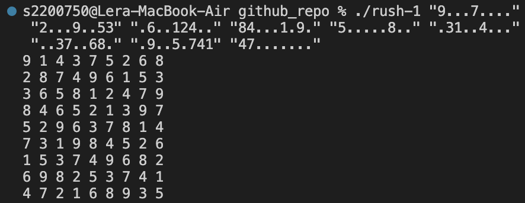

# Sudoku solver in C

## About

This project was created as a part of Hive Helsinki (school 42) month-long admission process (piscine).
- It had to comply with [the Subject](rush01.en.pdf).
- It had to comply with a strict code style guide - [The Norm](en.norm.pdf).
- It was a weekend project done in randomly assigned teams, however my teammates weren't able to contribute to the coding aspect of the project, so I was the only one writing the code.

## How to run

- `cd` into directory and compile the project as follows: `gcc -Wall -Wextra -Werror -o rush-1 *.c`
- Pass lines of sudoku as arguments to the program like so: `./rush-1 line0 line1 line2 line3 line4 line5 line6 line7 line8`
  Example: `./rush-1 "9...7...." "2...9..53" ".6..124.." "84...1.9." "5.....8.." ".31..4..." "..37..68." ".9..5.741" "47......."`

## Sudoku validity 

- A valid sudoku has only one possible solution.
- In case of error, the program displays ”Error” followed by a line break.
